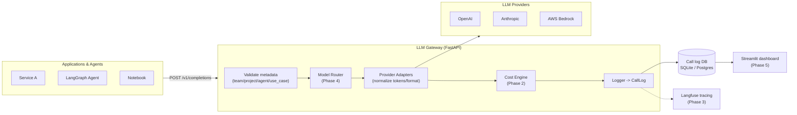

# LLM Cost Governance & Attribution Platform

**FinOps for LLMs.** A unified gateway that sits between application code and LLM
providers (OpenAI, Anthropic, AWS Bedrock), tags every call with team / project /
agent / use-case metadata, records tokens / cost / latency, routes simple tasks to
cheaper models, and reports spend back to Finance, Engineering, and Compliance.

> Built iteratively, phase by phase. Architecture decisions are recorded as ADRs
> in [`docs/adr/`](docs/adr/). Per-phase engineering challenges are in
> [`CHALLENGES.md`](CHALLENGES.md).

---

## Why this exists

Enterprises adopted LLMs fast (2023–2025) — every team got API keys to OpenAI,
Anthropic, and Bedrock, and nobody tracked spend per team, per use case, or per
agent. Finance sees one ballooning "AI" line item with zero attribution. Cloud
cost tools (AWS Cost Explorer) understand compute and storage, **not** tokens,
model pricing tiers, or per-agent attribution inside a single API account. This
platform adds the missing semantic layer: it knows that *"500K tokens on
`gpt-4o` for the recruiting-agent project"* is the unit of cost.

---

## Architecture



### Phase status

| Phase | Scope                                   | Status         |
|-------|-----------------------------------------|----------------|
| 1     | Foundation, unified gateway, DB logging | ✅ Done        |
| 2     | Config-driven cost calculation engine   | ⬜ Planned     |
| 3     | Langfuse observability integration      | ⬜ Planned     |
| 4     | Rule-based model router + savings       | ⬜ Planned     |
| 5     | Streamlit chargeback dashboard          | ⬜ Planned     |
| 6     | Budgets, policy violations, audit export| ⬜ Planned     |

---

## Quick start

Requires **Python 3.11+**.

```bash
# 1. Create a virtual environment and install deps
python -m venv .venv
# Windows PowerShell:
.venv\Scripts\Activate.ps1
# macOS/Linux:
# source .venv/bin/activate
pip install -r requirements.txt

# 2. Configure (mock mode is on by default — no API keys needed)
copy .env.example .env        # Windows
# cp .env.example .env        # macOS/Linux

# 3. See the pipeline run end-to-end with fake data
python scripts/demo_phase1.py

# 4. Run the gateway API
uvicorn llm_gateway.main:app --reload --app-dir src
# Open http://localhost:8000/docs
```

### Make a call

```bash
curl -X POST http://localhost:8000/v1/completions \
  -H "Content-Type: application/json" \
  -d '{
    "provider": "openai",
    "model": "gpt-4o-mini",
    "messages": [{"role": "user", "content": "Summarize Q3 earnings."}],
    "metadata": {
      "team": "finance-ai",
      "project": "earnings-digest",
      "agent_name": "summarizer",
      "use_case": "one-line-summary"
    }
  }'
```

A request missing any `metadata` field is rejected with a `422` — unattributed
spend is the problem this platform exists to prevent.

### Going live (real providers)

Set `GATEWAY_MOCK_MODE=false` in `.env` and provide credentials
(`OPENAI_API_KEY`, `ANTHROPIC_API_KEY`, AWS creds via the standard boto3 chain).
Provider SDKs are imported lazily, so you only need the SDKs for the providers
you actually use.

### Tests

```bash
pip install pytest
pytest
```

---

## Project layout

```
src/llm_gateway/
  config.py          # env-driven settings
  schemas.py         # Pydantic API contracts (incl. required CallMetadata)
  models.py          # SQLAlchemy CallLog — canonical record of every call
  db.py              # engine/session (SQLite or Postgres via DATABASE_URL)
  cost.py            # cost hook (stub in Phase 1, engine in Phase 2)
  gateway.py         # the one choke point every call flows through
  main.py            # FastAPI app
  providers/         # adapter layer normalizing OpenAI/Anthropic/Bedrock
docs/adr/            # architecture decision records
scripts/             # demo / seed scripts
tests/               # pytest suite
```

---

## Architecture Decision Records

- [ADR-001](docs/adr/001-fastapi-gateway-pattern.md) — FastAPI + proxy/gateway pattern over SDK wrappers
- [ADR-002](docs/adr/002-gateway-level-logging.md) — Gateway-level logging vs. per-application instrumentation
