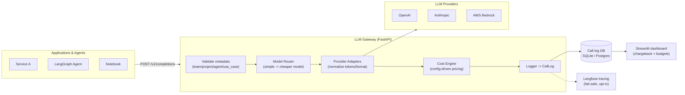

# LLM Cost Governance & Attribution Platform

**FinOps for LLMs.** A unified gateway that sits between application code and LLM
providers (OpenAI, Anthropic, AWS Bedrock), tags every call with team / project /
agent / use-case metadata, records tokens / cost / latency, routes simple tasks to
cheaper models, and reports spend back to Finance, Engineering, and Compliance.

> Built iteratively, phase by phase. Architecture decisions are recorded as ADRs
> in [`docs/adr/`](docs/adr/). Per-phase engineering challenges are in
> [`CHALLENGES.md`](CHALLENGES.md).

---

## Why this exists

Enterprises adopted LLMs fast (2023–2025) — every team got API keys to OpenAI,
Anthropic, and Bedrock, and nobody tracked spend per team, per use case, or per
agent. Finance sees one ballooning "AI" line item with zero attribution. Cloud
cost tools (AWS Cost Explorer) understand compute and storage, **not** tokens,
model pricing tiers, or per-agent attribution inside a single API account. This
platform adds the missing semantic layer: it knows that *"500K tokens on
`gpt-4o` for the recruiting-agent project"* is the unit of cost.

---

## Architecture



### Phase status

| Phase | Scope                                   | Status         |
|-------|-----------------------------------------|----------------|
| 1     | Foundation, unified gateway, DB logging | ✅ Done        |
| 2     | Config-driven cost calculation engine   | ✅ Done        |
| 3     | Langfuse observability integration      | ✅ Done        |
| 4     | Rule-based model router + savings       | ✅ Done        |
| 5     | Streamlit chargeback dashboard          | ✅ Done        |
| 6     | Budgets, policy violations, audit export| ⬜ Planned     |

---

## Quick start

Requires **Python 3.11+**.

```bash
# 1. Create a virtual environment and install deps
python -m venv .venv
# Windows PowerShell:
.venv\Scripts\Activate.ps1
# macOS/Linux:
# source .venv/bin/activate
pip install -r requirements.txt

# 2. Configure (mock mode is on by default — no API keys needed)
copy .env.example .env        # Windows
# cp .env.example .env        # macOS/Linux

# 3. See the pipeline run end-to-end with fake data
python scripts/demo_phase1.py

# 4. Run the gateway API
uvicorn llm_gateway.main:app --reload --app-dir src
# Open http://localhost:8000/docs
```

### Make a call

```bash
curl -X POST http://localhost:8000/v1/completions \
  -H "Content-Type: application/json" \
  -d '{
    "provider": "openai",
    "model": "gpt-4o-mini",
    "messages": [{"role": "user", "content": "Summarize Q3 earnings."}],
    "metadata": {
      "team": "finance-ai",
      "project": "earnings-digest",
      "agent_name": "summarizer",
      "use_case": "one-line-summary"
    }
  }'
```

A request missing any `metadata` field is rejected with a `422` — unattributed
spend is the problem this platform exists to prevent.

### Going live (real providers)

Set `GATEWAY_MOCK_MODE=false` in `.env` and provide credentials
(`OPENAI_API_KEY`, `ANTHROPIC_API_KEY`, AWS creds via the standard boto3 chain).
Provider SDKs are imported lazily, so you only need the SDKs for the providers
you actually use.

### Tests

```bash
pip install pytest
pytest
```

---

## Project layout

```
src/llm_gateway/
  config.py          # env-driven settings
  schemas.py         # Pydantic API contracts (incl. required CallMetadata)
  models.py          # SQLAlchemy CallLog — canonical record of every call
  db.py              # engine/session (SQLite or Postgres via DATABASE_URL)
  pricing.py         # config-driven pricing book + model-name resolution
  cost.py            # cost hook — calls the pricing engine per call
  observability.py   # Langfuse tracing (fail-safe, off by default)
  router.py          # rule-based complexity router + savings estimate
  budgets.py         # per-team budgets loaded from config
  reporting.py       # pure-pandas aggregations for the dashboard
  gateway.py         # the one choke point every call flows through
  main.py            # FastAPI app
  providers/         # adapter layer normalizing OpenAI/Anthropic/Bedrock
dashboard/app.py     # Streamlit chargeback dashboard (ADR-006)
config/pricing.yaml  # external, updatable rate card (ADR-003)
config/routing.yaml  # model routing rules (ADR-005)
config/budgets.yaml  # per-team budgets + alert thresholds (ADR-007)
docs/adr/            # architecture decision records
scripts/             # demo / seed scripts
tests/               # pytest suite
```

---

## Architecture Decision Records

- [ADR-001](docs/adr/001-fastapi-gateway-pattern.md) — FastAPI + proxy/gateway pattern over SDK wrappers
- [ADR-002](docs/adr/002-gateway-level-logging.md) — Gateway-level logging vs. per-application instrumentation
- [ADR-003](docs/adr/003-external-pricing-config.md) — External, updatable pricing config vs. hardcoded prices
- [ADR-004](docs/adr/004-langfuse-over-custom-tracing.md) — Langfuse for tracing vs. building custom observability
- [ADR-005](docs/adr/005-rule-based-routing-first.md) — Rule-based routing first vs. ML-based routing
- [ADR-006](docs/adr/006-streamlit-mvp-dashboard.md) — Streamlit for the MVP dashboard vs. a full React app

### Pricing (Phase 2)

Per-model rates live in [`config/pricing.yaml`](config/pricing.yaml), keyed by
`(provider, model)` with separate input/output rates per 1M tokens. Update a
price and reload it live — no redeploy:

```bash
curl -X POST http://localhost:8000/admin/reload-pricing
curl http://localhost:8000/pricing     # inspect current rates
```

> The numbers in the file are **illustrative examples** — verify against the
> providers' official pricing pages before using for real chargeback.

### Observability (Phase 3)

Every gateway call can mirror itself into [Langfuse](https://langfuse.com) as a
trace, tagged with the same `team/project/agent/use_case` metadata as the cost
record (see [ADR-004](docs/adr/004-langfuse-over-custom-tracing.md)). Tracing is
**off by default** and fail-safe — it never adds latency to or breaks a call.

```bash
# in .env
LANGFUSE_ENABLED=true
LANGFUSE_PUBLIC_KEY=pk-...
LANGFUSE_SECRET_KEY=sk-...
LANGFUSE_HOST=https://cloud.langfuse.com   # or your self-hosted instance
```

`GET /health` reports whether tracing is active.

### Model routing (Phase 4)

Simple tasks are automatically routed to cheaper models; complex ones are left
alone (see [ADR-005](docs/adr/005-rule-based-routing-first.md)). Rules live in
[`config/routing.yaml`](config/routing.yaml) and are hot-reloadable. Each routed
call logs `estimated_savings_usd` — a counterfactual vs. the requested model's
rate at the same token usage.

```bash
curl http://localhost:8000/routing            # inspect active rules
curl -X POST http://localhost:8000/admin/reload-routing
```

The response from `/v1/completions` includes `requested_model`, `model` (what
actually served the call), `routed`, and `estimated_savings_usd`.

### Dashboard (Phase 5)

A Streamlit chargeback dashboard ([dashboard/app.py](dashboard/app.py)) reads the
call-log DB and shows cost by team over time, cost by model, top use cases,
routing savings, and budget-vs-actual with alert thresholds (see
[ADR-006](docs/adr/006-streamlit-mvp-dashboard.md)). Budgets are config-driven in
[`config/budgets.yaml`](config/budgets.yaml).

```bash
python scripts/seed_data.py --reset    # generate ~30 days of sample data
streamlit run dashboard/app.py         # open the dashboard
```

Aggregation logic lives in [reporting.py](src/llm_gateway/reporting.py) (pure,
unit-tested pandas) — the Streamlit file is just the view.
